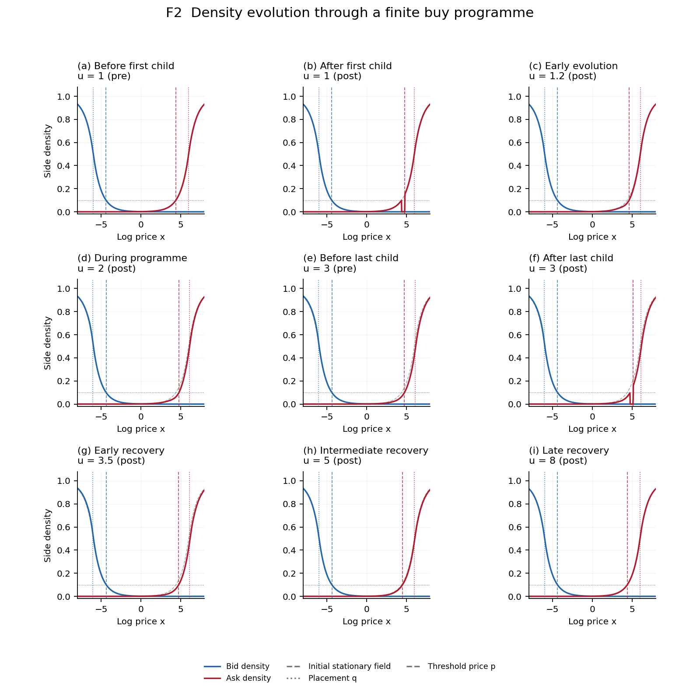
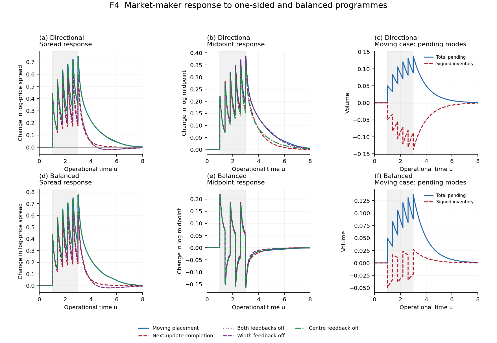
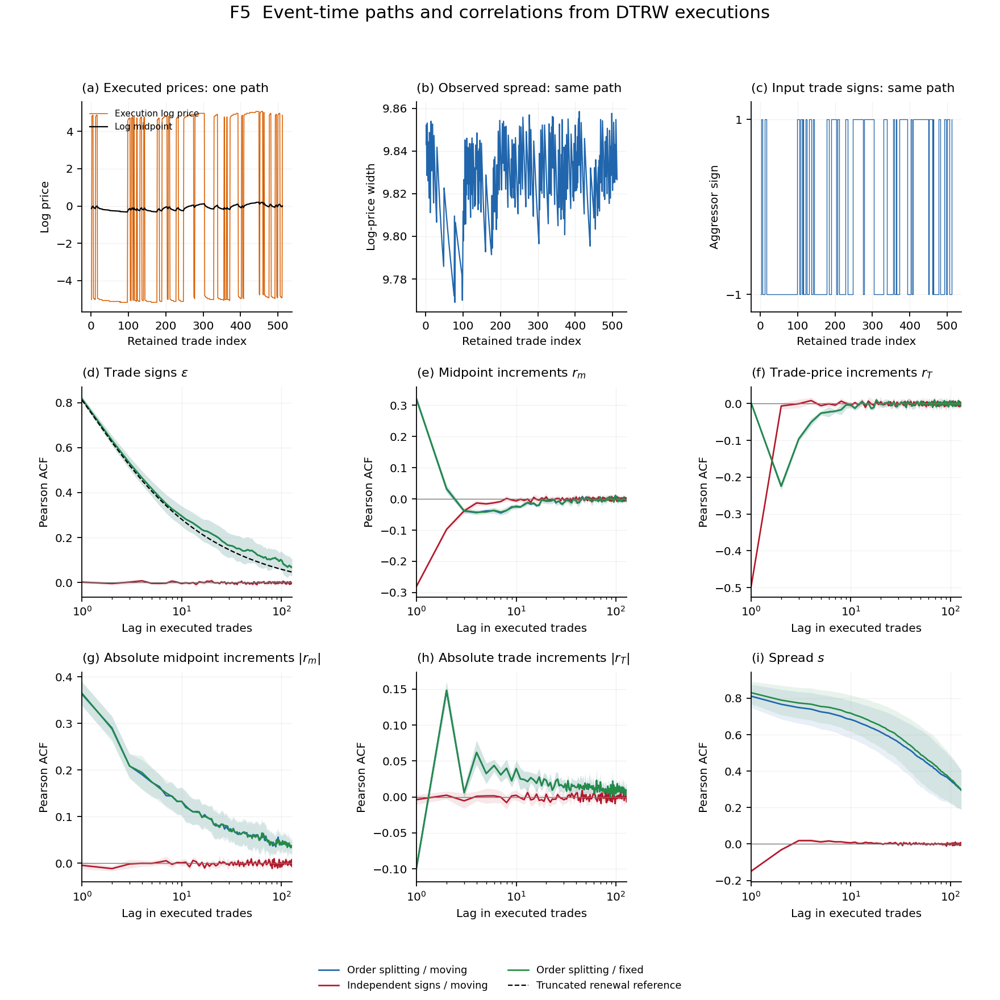
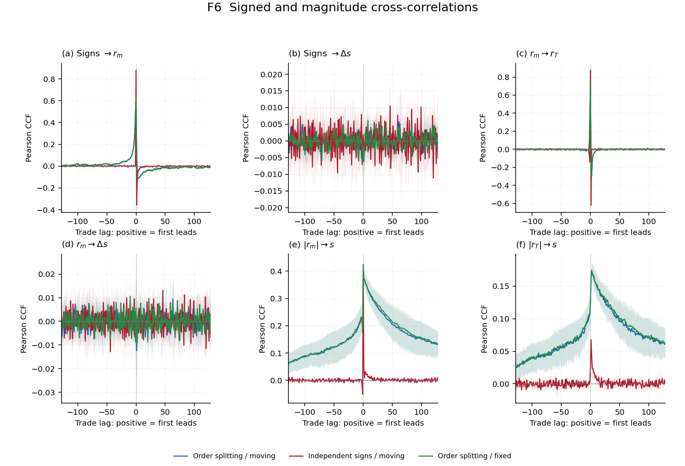
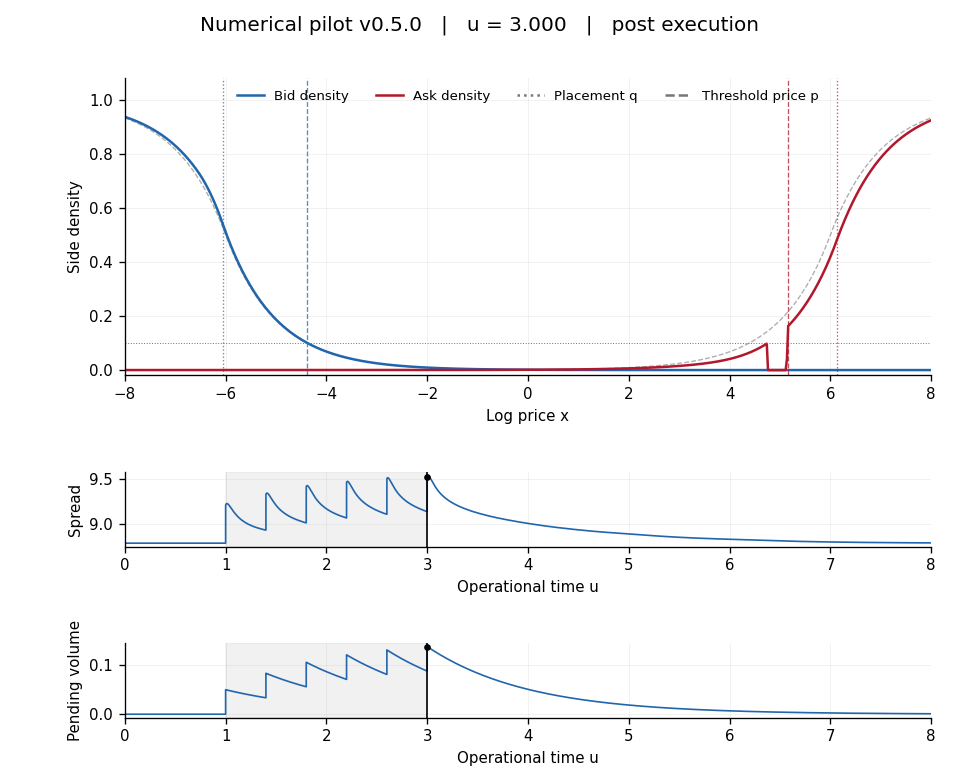

# Two Field Spread Reproducibility

**v0.5.0 — numerical assessment and market-maker/correlation diagnostics.** The requested density-derived figures and trade tape are implemented. Numerical convergence and scientific acceptance remain pending: midpoint and spread correlations are sensitive to resolution. The Markov DTRW core is unchanged from v0.4.1; no manuscript equation has been modified.

[Figures](#focused-numerical-outputs) · [Reproduce](#reproduce) · [Configuration](#configuration-and-retained-data) · [Assessment](#verification-and-current-limits) · [Market maker](#aggregate-agents-and-the-market-maker) · [DTRW lineage](#dtrw-compatibility)

The model evolves bid and ask densities in operational time through nearest-neighbour diffusion, cancellation and symmetric reaction. Actual aggressive executions initiate causal opposite-side replenishment. Pending exposure controls placement width and centre; inward density thresholds determine observed bid, ask, midpoint and spread. [Algorithm](provenance/ALGORITHM.md) and [supplement](provenance/supplement-v0.5.0.pdf) specify chronology, source geometry, execution and observation conventions.

## Focused numerical outputs



**F2. Density evolution.** Nine snapshots from six buys of volume 0.05 at u=1, 1.4, 1.8, 2.2, 2.6 and 3. Blue/red: bid/ask densities; grey: numerically relaxed initial field. Dotted placement quotes q differ from dashed threshold quotes p. The density threshold is 0.1. Pre/post pairs retain the execution impulse. Fixed display window [-8,8]; simulated domain [-12.0125,12.0125], dx=0.025, du=0.00025. Initial placement edges lie between grid nodes.


**F3. Same-run time series.** Observed bid/ask/midpoint and actual fill-weighted execution log prices; observed spread and placement width; total and signed post-event pending stock; cumulative execution/completion; placement centre. Placement uses the residual old stock after delivery, before the current execution. The cumulative-flow panel is in volume units. Midpoint is the midpoint in log price.



**F4. Market-maker controls.** One-sided and alternating buy/sell programmes have the same six absolute child volumes. Compare moving placement, next-update completion, both feedbacks off, width feedback off and centre feedback off. The displayed grid matches F2/F3. Responses subtract each case's initial stationary value; empty-pending reference dynamics coincide. Pending panels show post-event stock. The saved coarse/fine comparisons test sensitivity of the apparent feedback effect.



**F5. Paths and ACFs.** Top: first 512 retained events of seed 41001. Lower panels: true signs, midpoint increments, execution-log-price increments, their absolute increments, and spread. Each curve averages eight independent paths of 8192 retained events after 2048 burn events. Compare order splitting/moving placement, independent signs/moving placement, and the same splitting tapes/fixed placement. The dashed sign reference is the exact finite-cap stationary renewal benchmark. Bands are descriptive mean ± two between-path standard errors. These long paths use dx=0.05, du=0.001; two paired refinements expose material midpoint/spread sensitivity. They are diagnostic figures, not accepted limiting laws.



**F6. Cross-correlations.** Same paths and uncertainty convention as F5. Positive lag means the first observable leads the second. Signed sign/spread-change and midpoint/spread-change correlations can cancel under buy/sell symmetry; magnitude/spread correlations address a different question. Correlation does not establish causality.

[](figures/density-v0.5.0.mp4)

**V1. [24-second profile video](figures/density-v0.5.0.mp4).** The F2/F3 trajectory, fixed axes, operational-time/phase labels, spread and pending-stock cursors. Stored states are held between frames; children have consecutive pre/post frames. No interpolation across execution impulses. Five PNG/PDF figure pairs and one video constitute the focused inventory; no standalone theory gallery.

## Reproduce

Python 3.12 is the controlled environment. Install FFmpeg with the libx264 encoder and put `ffmpeg` on PATH. NumPy and Matplotlib are pinned in `pyproject.toml`.

From the repository directory, Linux/macOS:

```bash
python -m venv .venv
.venv/bin/python -m pip install -e .
.venv/bin/python scripts/run_all.py
```

Windows PowerShell, from the repository directory with Python installed:

```powershell
$ErrorActionPreference = 'Stop'
python -m venv .venv
if ($LASTEXITCODE -ne 0) { throw 'Environment creation failed' }
$Python = Join-Path (Get-Location) '.venv\Scripts\python.exe'
& $Python -m pip install -e .
if ($LASTEXITCODE -ne 0) { throw 'Installation failed' }
ffmpeg -version
if ($LASTEXITCODE -ne 0) { throw 'Install FFmpeg with libx264 and add it to PATH' }
& $Python scripts/run_all.py
if ($LASTEXITCODE -ne 0) { throw 'Reproduction failed' }
```

The command runs 23 focused tests, 18 numerical assessment cases, 23 market-maker comparisons, 26 long paths, and the four main pilot/control trajectories, then produces all figures and the video. A repeat uses the same command. `python scripts/run_all.py --render-only` verifies the configuration/code/data hashes and redraws from saved states without solving. A changed input requires the complete route. The tested runtime is Python 3.12.14, NumPy 2.3.5 and Matplotlib 3.10.8 on Linux; Windows execution remains a later milestone.

## Configuration and retained data

`config/experiments-v0.5.0.json` is the sole active configuration. All parameters are dimensionless and illustrative. D=nu=1, kappa=0.5, Sigma0=12, chi_s=2, chi_m=0.5, completion time=1, placement width=0.5. Equal lit/latent amplitudes and lengths make total external supply constant outside placement edges. There is no empirical calibration.

| Directory | Active content |
|---|---|
| `config/` | One complete experiment configuration |
| `functions/` | Core, observations, finite experiment driver, focused assessment, renderer |
| `scripts/` | One reproduction entry point |
| `tests/` | Three focused test files |
| `outputs/` | Fields, actual fills and paths, correlations, budgets, comparisons and hashes |
| `figures/` | F2–F6 PNG/PDF pairs; V1 MP4 and poster |
| `provenance/` | Algorithm, supplement, source identities and the retained v0.4.1 lineage audit |

The density archive retains incoming/pre/post states, actual removal profiles and source increments. Long-path NPZ data retain all 10240 events per path, signs, distinct parent IDs, parent lengths/ages, actual node fills and offsets; `columns` names the state matrix. `example-trades` is the complete first moving-path CSV with observation conventions and arithmetic/geometric prices. Correlation CSVs include pair counts. Budgets and admissibility are checked on every update, not just saved samples. Old generated versions remain in Git history and immutable checkpoints, outside the active file set.

The aggregate input has independent centred parent signs and capped integer lengths L=min(floor(2(1-U)^(-1/1.5)),512). Its first parent is length-biased with uniform age. New parents retain distinct IDs even when signs agree. Child volume is 0.002 every 0.01 operational units; seeds are 41001–41008, with a separate offset for the independent-sign null. The exact reference is E[(L-k)+]/E[L]. This is a single-active-parent renewal benchmark, not the full concurrent-parent LMF population. A fit window is reserved in the configuration, but no exponent has been fitted or accepted. Finite-cap data cannot establish asymptotic long memory.

## Verification and current limits

The 23 tests cover transport, reaction, budgets, positivity, causal completion, execution caps, threshold selection, reflection, initialization, trade measurements, lag alignment and the stationary parent-law/reference. Main trajectories fill the requested 0.3; maximum field/ledger errors are below 3.2e-15/2.6e-15 and no-event drift below 9.5e-9. All registered assessment and statistical paths completed without material unfilled demand. Accounting consistency does not establish convergence.

The large late spread offset on the original node-aligned grid decreases with dx: approximately 0.1967, 0.0982, 0.0497, 0.0264 for dx=0.1, 0.05, 0.025, 0.0125. Placing the initial edges between nodes makes these offsets much smaller. This identifies a discretization effect; finite-horizon offsets are not permanent impact. Time-step/domain effects are much smaller in the tested pilot, and execution depths 1 and 4 give identical paths. No source smoothing was introduced.

The finest midpoint/spread comparison still fails the registered 0.01 spread tolerance: maximum spread differences are 0.02059 on-node and 0.01224 between-node. Long-path paired refinement changes midpoint-increment ACFs by up to 0.225 and spread ACFs by up to 0.193. F5/F6 therefore cannot yet support a physical claim about those statistics. Trade-price increment statistics are less sensitive in these two pairs, which is not a general convergence result.

Order-splitting sign persistence is present as a declared input. Mean lag-one midpoint-increment ACF is about 0.319; returns are not white in this run. Independent-sign trade returns show strong bid/ask bounce (about -0.496 at lag one). Absolute trade increments have an alternating short-lag pattern; no universal volatility-clustering or square-root-impact claim is made. Spread half-window means are retained for inspection, but stationarity and sampling adequacy are not scientifically accepted.

The immediate next patch targets resolution of threshold quotes and price-priority execution under the same physical child volume. It must explain the sensitivity before expanding scientific scope. Supplement/caption finalization and portable reproduction follow; D1 design is accepted, D2 science and D3 release remain pending.

## Aggregate agents and the market maker

The fields aggregate order activity with an order-level DTRW interpretation. Static source terms do not automatically specify chartist/fundamentalist strategies. No extra agent population is needed for the current mechanism tests.

Total exposure Q_A+Q_B drives width; signed inventory Q_A-Q_B drives centre. At the last child, directional and balanced programmes have the same total post-event pending stock, about 0.1379, while the balanced signed stock is about 0.0272 in magnitude. This makes the distinction visible. Centre-only response is unresolved: its balanced maximum midpoint effect is 0, 0.01494 and 0.00737 across the three grids. The zero on the coarse grid reflects unchanged nodal support and must not be interpreted as an absent centre mechanism.

Opposite-side replenishment is a **completion-equivalent source closure**, with probabilities assumed inside its delivery/placement law. It is not an explicit second trade or a profit calculation. All specified aggressor executions are attributed to the aggregate market-making sector. Reaction loss and completion do not create synthetic trade prints. Exact volume accounting does not establish financial equilibrium. The positive Sigma0 floor is imposed, so this pilot does not establish emergence from zero standoff. A systematic spread-dependent meta-order response/impact study remains scoped for future v1.1.0.

## DTRW compatibility

The common Markov transport operator was checked against exact v2.0.0 source. The current paper uses Euler cancellation; the prototype uses an exponential survivor. Their finite-step difference and execution chronology are documented in the [algorithm mapping](provenance/ALGORITHM.md). These are matched-component checks, not whole-trajectory equality. Price observations and overlapping-pair Pearson correlations follow the prior executable convention, with pair counts, explicit lag direction and undefined constant-series correlations.

Future Sibuya transport needs a transport history and a derived treatment of reaction, births and consumed volume. Keep it separate from order-sign memory, finite-mean completion and calendar subordination. No fractional transport or calendar clock is implemented. The supplement records the raw-kernel, survival, scaling and completed-state observation conventions to preserve.

The prototype is [correlation-emergence v2.2.0](https://github.com/timgebbie/correlation-emergence-reproducibility/releases/tag/v2.2.0). This clean implementation has no runtime dependency on it. [Source provenance](provenance/SOURCES.md) connects the spread formulation to Diana–Gebbie CAM and Angstmann–Gebbie correlation emergence, with exact manuscript/prototype identities. Manuscripts and recovery administration remain outside this source tree.
