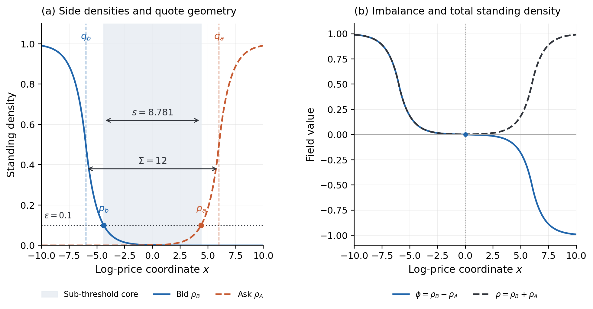
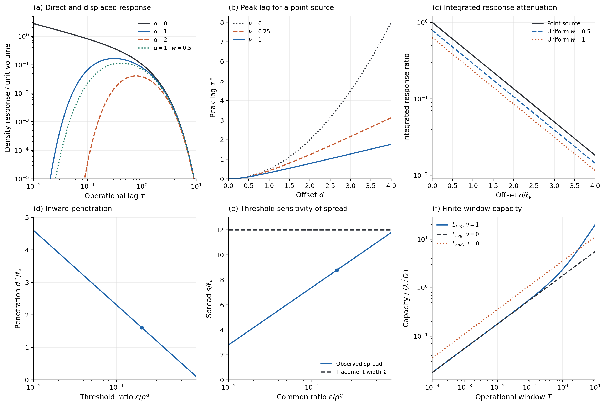

# Two Field Spread Reproducibility

**v0.2.0 — controlled theoretical plots.** Numerical companion to the TwoFieldSpread theory paper and letter. This version supplies analytic controls for the forthcoming minimal two-density DTRW implementation.

## Contents

- [Reference book](#reference-book)
- [Theoretical response](#theoretical-response)
- [Reproduce](#reproduce)
- [Files and provenance](#files-and-provenance)
- [Release route](#release-route)

## Reference book



**Figure 1.** Exact infinite-line reaction-off reference with D=nu=1, unit constant supply outside the placement quotes q_b=-6 and q_a=6, and no completion prehistory. All quantities use declared dimensionless units. (a) Bid and ask densities cross epsilon=0.1 at p_b=-4.390562 and p_a=4.390562. The observed spread is 8.781124; the placement width is 12. The shaded core is below both execution thresholds and has positive standing density. (b) Imbalance and total density have distinct roles: the central imbalance zero does not determine the two threshold quotes. This is an analytic control, not a simulated stationary state with positive reaction or market-maker feedback.

On this control's inward branch,

$$d^*=\ell_\nu\ln(\rho^q/\epsilon),\qquad s=\Sigma-2d^*,\qquad \ell_\nu=\sqrt{D/\nu}.$$

These expressions are exact for the chosen step-source control. Their application to the full coupled model requires the paper's separation and weak-overlap conditions.

## Theoretical response



**Figure S1.** Controlled whole-line theory in dimensionless units, with D=1. (a) Direct and point-displaced density kernels at nu=1; the dotted curve retains a unit-mass uniform source of width 0.5 outward from offset 1. The logarithmic display omits values below its lower limit; all values are retained in the CSV. (b) Point-source peak lag for three cancellation rates; d=0 is excluded because its direct kernel has a singular initial maximum. (c) Integrated density-response ratios at nu=1, including finite source widths. These ratios are not delivered-volume fractions. (d,e) Penetration and observed spread as both sides' common threshold ratio varies, for the exact reference family with placement width 12. Dots mark Figure 1; positive spread alone is not a dynamical separation test. (f) Direct-depletion capacity defined by the window-average displacement rate; the separate endpoint convention is shown for nu=0. No calendar-time mapping is imposed.

The full formulas, conditions and source equation labels are in [the equation map](provenance/EQUATION-MAP.md). Twelve tests compare the evaluators with independent quadrature, root finding, optimization, stationary residuals and limits. Lattice convergence and meta-order response are subsequent work.

## Reproduce

From the extracted project directory in Windows PowerShell, with Python 3.11 or later (tested here with Python 3.12.14):

```powershell
$ErrorActionPreference = 'Stop'
python -m venv .venv
if ($LASTEXITCODE -ne 0) { throw 'Environment creation failed' }
$Python = Join-Path (Get-Location) '.venv\Scripts\python.exe'
& $Python -m pip install -e .
if ($LASTEXITCODE -ne 0) { throw 'Dependency installation failed' }
& $Python scripts/run_all.py
if ($LASTEXITCODE -ne 0) { throw 'Theory reproduction failed' }
```

Regenerate the figures from verified saved tables without reevaluating the formulas:

```powershell
& $Python scripts/run_all.py --plots-only
if ($LASTEXITCODE -ne 0) { throw 'Saved-data figure regeneration failed' }
```

The full route runs tests, saves data/configuration/source hashes and renders PNG/PDF. The plot-only route rejects altered data or a stale calculation/configuration. Dependency versions are pinned in `pyproject.toml`. The registered figure configuration is deliberately narrow; edits to physical parameters or curve groups must also revise the figure annotations and verification. Windows execution will be checked at the later restoration gate.

## Files and provenance

| Directory | Content |
|---|---|
| `config/` | Registered theory control and output scope |
| `functions/` | Scalar evaluators and saved-data renderer |
| `scripts/` | Full and plot-only entry point |
| `tests/` | Independent evaluator verification |
| `outputs/` | Six CSV tables, summary, hashes and environment |
| `figures/` | Two combined figures in PNG and vector PDF |
| `provenance/` | Source identities, equation map and scientific scope |

[Correlation-emergence v2.2.0](https://github.com/timgebbie/correlation-emergence-reproducibility/releases/tag/v2.2.0) is the numerical and presentation prototype. This project is a clean, thinned implementation for two sides of one market. Current code is independently written; no prototype runtime dependency is introduced. See [source provenance](provenance/SOURCES.md).

## Release route

v0.1.0 design → v0.2.0 theory → v0.3.0 DTRW core → v0.4.0 reduced experiments → v0.5.0 scientific assessment → v0.6.0–v0.9.0 supplement, integration and reproduction → v1.0.0. Patch versions record corrections within milestones.

The v1.0.0 target includes density evolution, bid/ask/midpoint/spread time series, market-maker controls and a short animation from one saved meta-order trajectory. A subsequent v1.1.0 study will examine how market-maker-driven spread dynamics influence meta-order response and impact.
