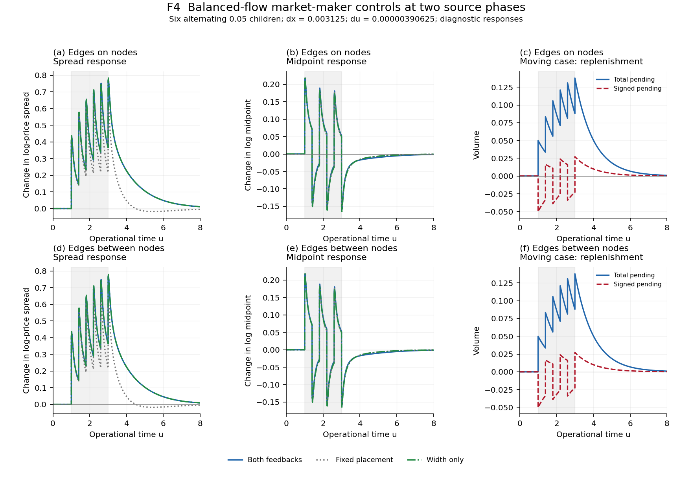
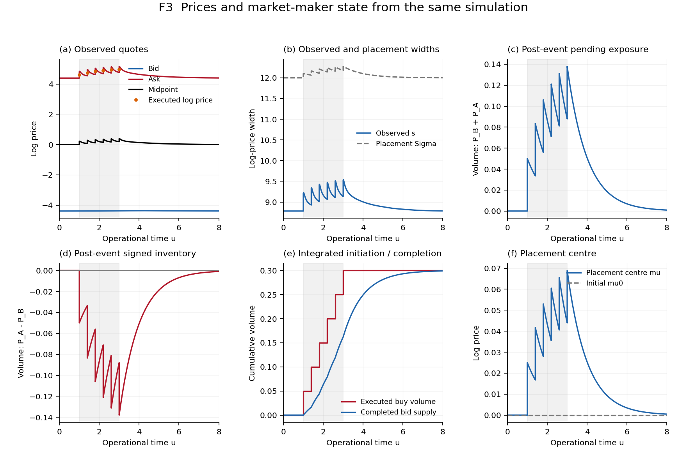
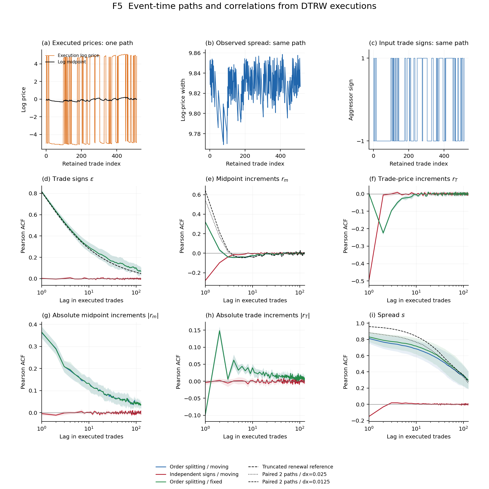
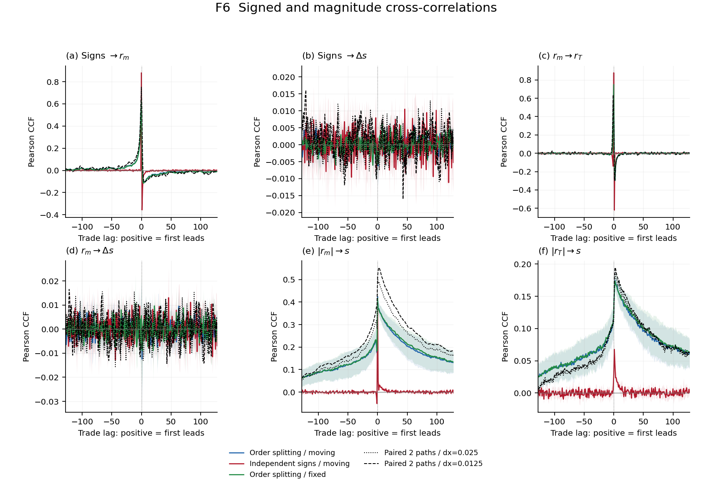

# Two field spread reproducibility bundle

Version: v0.6.1

Supplementary code and materials for:

> Christopher Angstmann, Derick Diana and Tim Gebbie,
> **“A Finite Bid–Ask Spread from Replenishment Displaced from the Quote.”**
> Forthcoming preprint.

The supplementary-materials document is included here:

> [Two Field Spread: numerical algorithms](provenance/supplement-v0.6.0.pdf)
> ([LaTeX source](provenance/supplement-v0.6.0.tex)).

This repository is a quantitative-finance reproducibility bundle. It implements
bid and ask liquidity as separate densities on a log-price lattice and studies
how depletion, delayed opposite-side replenishment and the placement of supply
change the quoted spread. The code regenerates or verifies five selected
figures, a profile video and the numerical evidence used in the supplement.
All experiments use declared synthetic inputs.

[Current situation](#current-situation-v061) ·
[Future situation](#future-situation-possible-extensions) ·
[Scientific boundary](#scientific-boundary) ·
[Provenance](#dtrw-and-reaction-diffusion-provenance) ·
[Reproduce](#reproducing-the-active-outputs) ·
[Citation](#doi-citation-and-license)

## Key figure: balanced-flow spread response



**Figure F4. Spread response under balanced buying and selling.**
Panels (a,d) show the change in quoted spread, (b,e) the change in log
midpoint, and (c,f) total and signed pending replenishment in the moving case.
The upper row places the initial supply edges on lattice nodes; the lower row
places them between nodes. Blue curves use both width and centre feedback,
grey dotted curves use fixed placement, and green dash-dotted curves use width
feedback alone. Each programme contains six alternating buy/sell children of
volume 0.05 at $u=1,1.4,1.8,2.2,2.6,3$, followed to $u=8$.
Responses subtract each case's stationary initial value. The grid is
$\Delta x=0.003125$, $\Delta u=0.00000390625$; corresponding columns have
common axes, and pre/post-event values retain the execution jumps.

Balanced signed flow can leave a substantial total pending stock. At these
parameters, the spread response with width feedback alone closely follows the
response with both feedbacks, while fixed placement gives a different
relaxation. The figure makes the distinction between gross pending exposure
and its signed imbalance visible. It does not assign additive causal shares
to width and centre feedback.

The twelve targeted time/space comparisons meet the unchanged 0.01
absolute-spread tolerance. Maximum baseline-subtracted spread-response
differences are 0.00001486 for time and 0.00439334 for space; all six
successive spatial response differences decrease. These support the retained
finite-grid comparison without establishing a continuum limit or convergence
order. No separate response tolerance is introduced.

The [PDF export](figures/controls-v0.5.6.pdf),
[saved control trajectories](outputs/market-maker-v0.5.6.npz) and
[paired comparison report](outputs/control-comparisons-v0.5.6.json)
accompany the supplement. Centre-only and interaction results remain available
at their earlier resolution.

## Current situation: v0.6.1

The current bundle separates the model into three operations:

1. bid and ask densities evolve by diffusion, cancellation, symmetric reaction
   and external supply on one uniform operational-time grid;
2. explicit aggressive executions remove available side liquidity and initiate
   pending replenishment on the opposite side;
3. the pending stocks determine supply placement, while density thresholds and
   actual fills determine the observed quotes and execution prices.

A buy consumes ask liquidity and initiates bid replenishment; a sell consumes
bid liquidity and initiates ask replenishment. Delivery from old pending
cohorts precedes the field update and current execution. Newly initiated
replenishment cannot complete in that same update.

Let $Q_B,Q_A$ denote residual pending bid/ask replenishment after delivery and
before current execution. The placement law is

$$
Q_\Sigma=Q_A+Q_B,\qquad Q_\Delta=Q_A-Q_B,
$$

$$
\Sigma=\Sigma_0+\chi_s Q_\Sigma,\qquad
\mu=\mu_0-\chi_m Q_\Delta,\qquad
q_b=\mu-\Sigma/2,\quad q_a=\mu+\Sigma/2.
$$

The placement edges $q_b,q_a$ delimit the supply geometry. The observed bid
and ask $p_b,p_a$ are inward density-threshold crossings, with
$s=p_a-p_b$ and $m=(p_a+p_b)/2$. Thus the model records both placement width
and quoted spread, and both placement centre and log midpoint. Execution log
prices are fill-volume-weighted averages of the consumed node coordinates;
geometric execution price and arithmetic price VWAP are saved separately.

The bundle contains:

- the Markov two-side DTRW solver and explicit execution/completion accounting;
- one-sided buy programmes and matched balanced-flow feedback comparisons;
- time, space, domain and source-phase assessments with retained raw outputs;
- declared order-splitting and independent-sign inputs for longer trade tapes;
- event-time price, sign, spread and correlation diagnostics;
- frozen-field execution/source probes and paper-to-discretization checks; and
- one reproduction entry point, with separate saved-data diagnosis and rendering.

The selected figure sequence is:

| Figure | Scientific question | Numerical evidence |
|---|---|---|
| F2 | How do executions and delayed replenishment change the side densities? | Density snapshots from a finite buy programme |
| F3 | How do quoted prices, spread and pending stock evolve together? | Prices and market-maker state from the same trajectory |
| F4 | How do width and centre feedback enter a balanced-flow response? | Matched feedback controls at two source/grid phases |
| F5 | How does declared sign persistence appear in executed price and spread statistics? | Actual trade paths, renewal reference and ACFs; diagnostic |
| F6 | What lagged dependence is present among flow, price increments and spread? | Signed and magnitude CCFs; diagnostic |
| V1 | What happens immediately before and after each execution? | Held density states and phase-labelled trajectory video |

### Figure F2: density depletion and replenishment


**Figure F2. Density evolution through six buy children.**
Nine snapshots show bid density in blue, ask density in red and the relaxed
initial field in grey. Dotted lines mark placement edges and dashed lines mark
observed threshold quotes. Each child has volume 0.05, at the same times used
in F4. The grid is $\Delta x=0.025$, $\Delta u=0.00025$, the threshold is
0.1 and the computational domain is $[-12.0125,12.0125]$. The display window
is $[-8,8]$. Labelled pre/post-event pairs show immediate consumption
separately from subsequent field evolution and replenishment.

This is the density trajectory underlying F3 and V1. Its pilot grid is coarser
than the balanced-control grid in F4. The
[PDF](figures/density-v0.5.6.pdf),
[density archive](outputs/density-v0.5.6.npz) and
[snapshot index](outputs/density-index-v0.5.6.csv) retain the displayed states.

### Figure F3: prices and market-maker state



**Figure F3. Prices, placement and pending replenishment from one run.**
Panel (a) shows observed bid/ask, log midpoint and actual fill-weighted execution
log prices; (b) compares observed spread with placement width; (c,d) show
post-event total and signed pending stock; (e) records cumulative initiation
and completion; and (f) shows the placement centre. The panels share the
F2 event programme and operational-time axis. Completion is recorded in
volume units and creates no additional trade print.

The paired price and inventory panels connect the source-placement law to
the density-defined observations. They also distinguish a completed supply
volume from an observed transaction. The [PDF](figures/timeseries-v0.5.6.pdf),
[state series](outputs/moving-v0.5.6.csv) and
[execution tape](outputs/moving-trades-v0.5.6.csv) provide the numerical values.

### Figure F5: order-flow memory and event-time autocorrelations



**Figure F5. Declared sign memory and the resulting execution statistics.**
The upper row shows execution log price and log midpoint, observed spread,
and aggressor signs for the first 512 retained events of seed 41001.
The remaining panels show ACFs of signs, midpoint increments, execution-price
increments, their absolute increments, and spread. Blue curves use order
splitting with moving placement, red curves independent signs with moving
placement, and green curves the same splitting tapes with fixed placement.
Each coloured mean uses eight independent paths with 2048 burn events and
8192 retained events, child volume 0.002 and spacing 0.01 in operational time.
Shading is the mean plus or minus two between-path standard errors.

The coloured paths use $\Delta x=0.05$, $\Delta u=0.001$.
The dashed sign reference is the exact finite-cap stationary renewal
correlation $C_\epsilon(k)=\mathbb{E}[(L-k)_+]/\mathbb{E}[L]$.
Black midpoint/spread curves compare two matched full tapes at
$\Delta x=0.025$ and $0.0125$, with common $\Delta u=0.0000625$;
they have no ensemble band. Lags count executed trades. The ACF estimator
centres each overlapping slice separately.

The heavy-tailed parent lengths are an input order-splitting mechanism.
Midpoint/spread correlations remain spatially sensitive; neither whitening
nor a limiting long-memory law is established by these curves. The
[PDF](figures/autocorrelations-v0.5.6.pdf),
[retained paths](outputs/statistics-paths-v0.5.6.npz) and
[correlation values](outputs/correlations-v0.5.6.csv) preserve the evidence.

### Figure F6: flow, price and spread cross-correlations



**Figure F6. Lagged dependence among executed flow, price increments and spread.**
Panels (a–f) show $(\epsilon,r_m)$, $(\epsilon,\Delta s)$,
$(r_m,r_T)$, $(r_m,\Delta s)$, $(|r_m|,s)$ and $(|r_T|,s)$, respectively.
Here $r_m$ and $r_T$ are consecutive-execution increments in log midpoint and
execution log price. Colours, path ensembles, shading and black paired-grid
curves follow F5. Positive lag means the first observable leads the second.
The two rows share the signed trade-lag convention and zero-lag reference.

Signed spread-change correlations can cancel under buy/sell symmetry;
magnitude/spread correlations describe another aspect of dependence.
Spatial sensitivity remains unresolved, and these correlations do not
identify causal effects. The [PDF](figures/cross-correlations-v0.5.6.pdf) and
[correlation archive](outputs/correlations-v0.5.6.npz) accompany F5.

### Video V1: the density trajectory through executions

[](figures/density-v0.5.6.mp4)

**Video V1. Density profiles and market-maker state through the finite programme.**
The [24-second video](figures/density-v0.5.6.mp4) follows the F2/F3 trajectory
with fixed axes and operational-time/phase labels. Stored density states are
held between frames. Each execution has consecutive pre/post frames, with
no interpolation across the impulse. Video time is a presentation coordinate;
the [frame index](outputs/video-frames-v0.5.6.csv) records the corresponding
operational time and phase.

### DTRW and reaction-diffusion provenance

The order-book antecedent is Diana and Gebbie,
[*Non-uniformly sampled simulated price impact of an order-book*](https://doi.org/10.1016/j.cam.2024.116202),
which explicitly identifies the need for separate side densities to represent
a nonzero spread. The supplied long paper develops the two-field placement
and completion construction; the current Angstmann–Diana–Gebbie letter
presents the displaced-replenishment mechanism and its analytical response.
The quoted midpoint, reaction price and source-placement centre remain
distinct objects in this implementation.

The numerical and presentation reference is
[correlation-emergence v2.2.0](https://github.com/timgebbie/correlation-emergence-reproducibility/releases/tag/v2.2.0),
commit `70e88f7`. Exact v2.0.0 components at commit `3107bac` were inspected
for the Markov transport operator, actual-fill execution log prices,
trade-sign classifications, overlapping-pair correlations and
previous-completed-state observation. Its two-book representation supplies
methodological antecedents for this two-side representation of one book.
The core and tests here were independently written; no prototype production
module is imported as a runtime dependency.

The finite-step differences are explicit. The spread solver uses Euler
cancellation and consumes after the field update; the inspected prototype
uses an exponential survivor and consumes before advancing the field.
With reaction off, the transport probability maps as
$r=2D\Delta u/\Delta x^2$. The cancellation-free interior operators agree
to roundoff; at positive cancellation the one-step difference is
$(e^{-\nu\Delta u}-1+\nu\Delta u)\rho$.
These component checks do not assert whole-model equivalence.

The [source record](provenance/SOURCES.md),
[algorithm mapping](provenance/ALGORITHM.md) and
[executed compatibility checks](provenance/compatibility-v0.4.1.json)
record the inspected components and manuscript identities. The current
letter is SpreadLetter v1.2.0 and the supplied long paper is v1.1.9.
Their original sources remain unchanged. Private manuscript packages remain
outside the public repository.

## Future situation: possible extensions

Possible later extensions include:

- systematic spread-dependent single-child and meta-order response, including
  common-input shocked/control comparisons across volume, rate and duration;
- further spatial, temporal and source-phase assessment of the longer
  midpoint/spread correlation paths;
- a derived fractional two-side transport model, with explicit history
  accounting for reaction, cancellation, new supply and consumed volume;
- separate calendar observation clocks applied to completed operational paths;
  and
- empirical comparison and parameter identification from order-book and
  transaction data.

The spread/impact programme is the proposed v1.1.0 extension. Transport memory,
order-splitting sign memory, finite-mean completion and calendar subordination
are separate mechanisms. A fractional history must preserve removal of
consumed volume; a calendar observation map must retain the completed-state
convention. Infinite-mean completion would require reconsidering the stationary
placement assumptions. These extensions are not implemented in the current
bundle.

## Scientific boundary

The present results concern a finite-grid liquidity and replenishment
mechanism under dimensionless synthetic parameters. Positive baseline
placement width $\Sigma_0=12$ is imposed. The observed spread is read from
the resulting density profiles; spontaneous spread formation from zero
standoff is not demonstrated. Static lit/latent supply does not specify an
individual chartist or fundamentalist strategy.

Opposite-side replenishment is a completion-equivalent source closure.
Actual execution, completed supply and pending stock have separate ledgers.
Their volume accounting does not establish dealer-profit equilibrium or
independently observed settlement of a second leg.

The stationary sign benchmark has one active parent, independent centred
parent signs and capped lengths
$L=\min(\lfloor 2(1-U)^{-1/1.5}\rfloor,512)$.
Its initial parent is length-biased with uniform age. It is not the full
concurrent-parent LMF population. No asymptotic sign-memory exponent,
square-root impact law or universal volatility-clustering result is fitted
or accepted here.

F2/F3/F4/V1 support the recorded finite-grid interpretation; F5/F6 remain
diagnostic. Hard nodal source supports and node-centre execution are retained
without smoothing. Centre-only and nonlinear interaction results retain their
v0.5.5 resolution. The current solver is Markovian in operational time;
fractional transport and calendar clocks remain future extensions.

## Repository structure

| Directory | Active content |
|---|---|
| `config/` | Fixed physical parameters, event programmes and numerical assessments |
| `functions/` | Side-density recurrence, fills, observations, experiments and rendering |
| `scripts/` | Reproduction and saved-data verification entry point |
| `tests/` | Numerical update, accounting, observations and assessment checks |
| `outputs/` | Saved states, execution tapes, correlations, refinement reports and hashes |
| `figures/` | F2–F6 PDF/PNG pairs, V1 MP4 and poster |
| `provenance/` | Computational supplement, source identities and equation-to-code mapping |

[`experiments-v0.5.6.json`](config/experiments-v0.5.6.json) is the sole active
configuration. The density archive retains incoming/pre/post fields, removals
and separate completion/lit/latent increments. Long paths retain all 10240
events, signs, parent records, actual fills and offsets; correlation records
include pair counts. Resolution diagnostics retain source-membership changes
and the execution/field decomposition of midpoint increments.

Scientific object versions remain in filenames where they identify accepted
inputs and outputs. Numerical/package identities remain v0.5.6; the current
supplement is v0.6.0. The v0.6.1 correction concerns recovery only. Earlier
scientific outputs remain in Git history.

## Installation

Python 3.12 is the controlled environment. NumPy 2.3.5 and Matplotlib 3.10.8
are pinned by `pyproject.toml`. Install FFmpeg with libx264 and make `ffmpeg`
available on PATH; the runner checks for it in every mode. Building the
supplement separately also requires pdfLaTeX.

Tracked text files use LF through `.gitattributes`; NPZ archives, PNG/PDF
figures and video are binary. This preserves manifest-relevant input bytes
in a standard Windows clone.

From a fresh clone, on Linux/macOS:

```bash
python -m venv .venv
.venv/bin/python -m pip install -e .
```

On Windows PowerShell:

```powershell
$ErrorActionPreference = 'Stop'
python -m venv .venv
if ($LASTEXITCODE -ne 0) { throw 'Environment creation failed' }
$Python = Join-Path (Get-Location) '.venv\Scripts\python.exe'
& $Python -m pip install -e .
if ($LASTEXITCODE -ne 0) { throw 'Installation failed' }
ffmpeg -version
if ($LASTEXITCODE -ne 0) { throw 'Install FFmpeg with libx264 and add it to PATH' }
```

The commands below use the environment's Python. Substitute `.venv/bin/python`
on Linux/macOS or `& $Python` in PowerShell. Windows reproduction remains
unconfirmed.

## Reproducing the active outputs

For the complete numerical route, run:

```bash
python scripts/run_all.py
```

The runner checks the pinned dependencies and runs 29 focused tests,
24 assessment cases, 51 market-maker comparisons, 26 benchmark paths,
four common-step resolution paths and four main pilot/control trajectories.
It regenerates the diagnostics, figures, video and output manifest.
The same command performs a complete numerical repeat.

For verification from the retained arrays, use a separate validation copy:

```bash
python -B -m unittest discover -s tests -v
python -B scripts/run_all.py --diagnose-only
python -B scripts/run_all.py --render-only
```

Diagnosis verifies the saved configuration/code/data hashes and reproduces
the frozen-operator and paper-to-discretization reports. Rendering verifies
the same manifest before and after regenerating all five figure pairs, the
video, poster and frame index. These modes evolve no production path.
The immutable data manifest is
[`manifest-v0.5.6.json`](outputs/manifest-v0.5.6.json).

For selected numerical repeats, `--refine-only` repeats six registered finite
refinement paths, while `--controls-only` repeats twelve targeted balanced
controls and preserves the 39 inherited controls. Both require exact saved
array/report reproduction. A changed dynamical input requires the complete
route. Pending acceptance wording in retained executable messages describes
the earlier development state; the scientific interpretation above and in
the supplement is current.

## Verification status

In the controlled cloud environment, all 29 tests passed. Saved-data diagnoses,
all five PNG/PDF figure pairs, V1, the poster and frame index reproduced
exactly. The six-page supplement was compiled twice from its exact source,
matched the retained PDF, and was visually inspected on all six pages.
The verified runtime was Python 3.12.14, NumPy 2.3.5, Matplotlib 3.10.8,
FFmpeg 6.1.1 with libx264, and pdfTeX 1.40.25 / TeX Live 2023.

The v0.5.6 numerical evidence includes independent exact repeats of all twelve
new targeted control paths and preservation of the 39 inherited controls.
Those production paths were not rerun for the v0.6.0 documentation or the
v0.6.1 recovery correction. Restoration also verified the committed snapshot
and the protected scientific files.

Cloud byte identity applies to the recorded environment. Windows reproduction
has not yet been confirmed, and cross-platform PDF/video identity is not
inferred from the cloud checks. The finite-grid numerical comparisons and
measurement conventions determine the scientific scope; regeneration alone
does not establish a continuum limit or a statistical scaling law.

## Version-control policy

The development versions retain the scientific lineage:

| Version | Established or changed | Current status |
|---|---|---|
| v0.0.0 | Minimal repository scaffold | Historical baseline |
| v0.4.1 | Markov operator and measurement compatibility inspection | Core and component audit retained |
| v0.5.6 | Targeted time/space refinement of balanced-flow response | Numerical source, data and figures retained |
| v0.6.0 | Algorithm supplement and finite-grid interpretation | Current scientific documentation |
| v0.6.1 | Recovery-helper correction | Same scientific/document snapshot |
| v1.0.0 | First formal release accompanying the preprint | Planned; no tag or release yet |

The planned public asset is `two-field-spread-reproducibility-v1.0.0.zip`.
Its tag and citation will be finalized after the preprint is public.
Versioned scientific filenames are preserved rather than renamed solely to
match a release number.

## DOI, citation and license

Suggested paper citation, pending the preprint identifier:

> Angstmann, Christopher; Diana, Derick; Gebbie, Tim.
> *A Finite Bid–Ask Spread from Replenishment Displaced from the Quote*.
> Forthcoming preprint.

| Item | Value |
|---|---|
| Associated paper | Forthcoming preprint |
| Supplementary PDF | [Two Field Spread: numerical algorithms](provenance/supplement-v0.6.0.pdf) |
| GitHub repository | [two-field-spread-reproducibility](https://github.com/timgebbie/two-field-spread-reproducibility) |
| Software DOI | Not recorded in the current repository |
| Code and supplementary-content licenses | Not yet declared in the current repository |

The manuscript and inspected-component identities are recorded in
[`provenance/SOURCES.md`](provenance/SOURCES.md). The license terms of the
antecedent repositories are not assigned to this independently written code
by inference.
