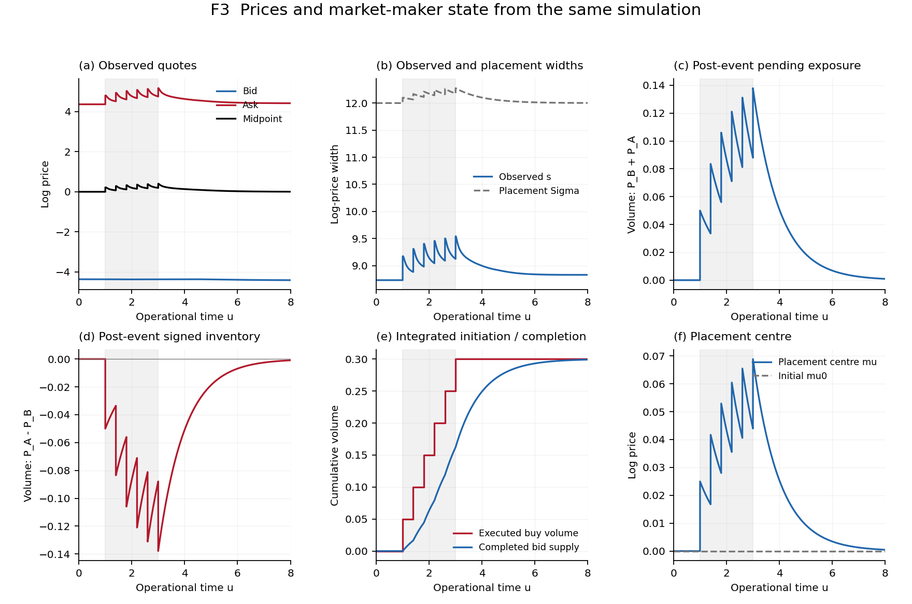
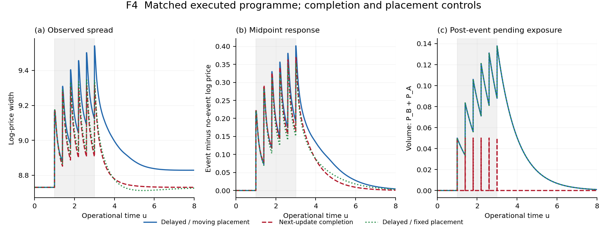
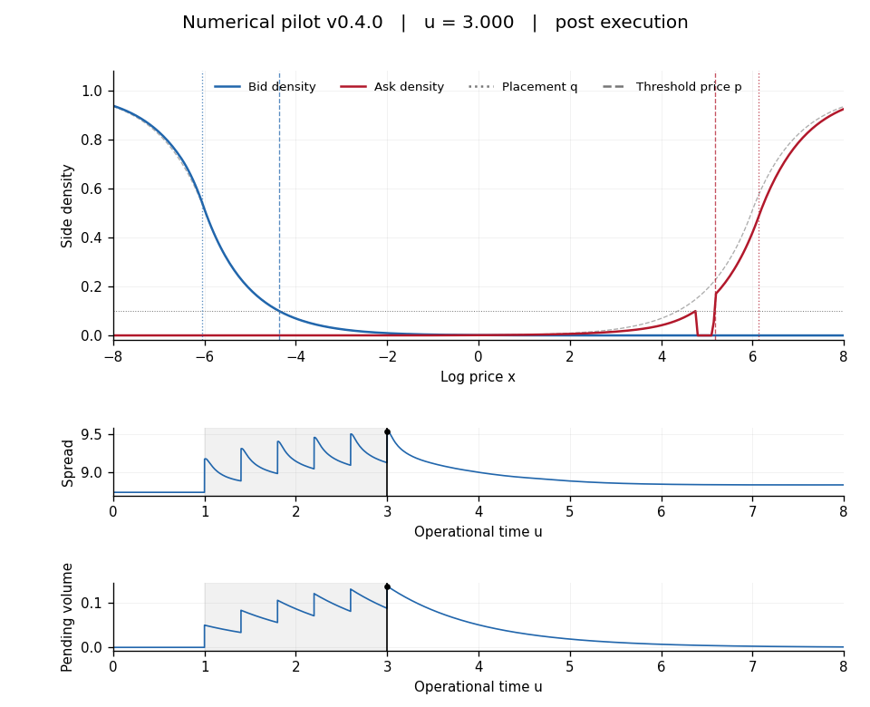

# Two Field Spread Reproducibility

**v0.4.0 — numerical experiment pilot.** A clean, reduced DTRW implementation of the two side-density model in the TwoFieldSpread paper and letter. The numerical results below are preliminary; convergence assessment is the next stage.

The model evolves bid and ask densities in operational time using nearest-neighbour diffusion, cancellation and symmetric reaction. A finite buy programme consumes the ask side. Executed volume initiates causal replenishment on the bid side; residual pending inventory determines placement width and centre. Inward density thresholds determine observed bid, ask, midpoint and spread. [Algorithm and conventions](provenance/ALGORITHM.md) specify the chronology, inventories, execution cap and volume budgets.

## Focused numerical outputs


**F2. Density evolution.** Nine snapshots of the same delayed-completion, moving-placement simulation. Six buy children of volume 0.05 arrive at u=1, 1.4, 1.8, 2.2, 2.6 and 3. Blue/red are bid/ask densities; grey is the numerically relaxed initial field. Coloured dotted lines are placement quotes q; dashed lines are observed threshold prices p. The horizontal dotted line is the fixed density threshold 0.1. Pre/post pairs show the actual execution impulse. All panels have fixed axes; the displayed log-price window is [-8,8] within the simulated domain [-12,12].



**F3. Same-run time series.** Observed quotes; observed spread and placement width; post-event pending stock; signed post-event inventory; cumulative executed and completed volumes; placement centre. The shaded interval spans the buy programme. P denotes stock after execution, whereas placement uses Q after old-cohort delivery and before the current execution. Panel (e) displays integrated flows in volume units, not impulse heights divided by a numerical time step. Midpoint is the arithmetic midpoint in log price.



**F4. Matched controls.** Delayed completion with moving placement; completion at the next update; delayed completion with fixed placement. Every case executes the same six child volumes, totalling 0.3. The midpoint response subtracts the shared no-event trajectory; their empty-pending no-event equations coincide. Delayed cases have overlapping pending-stock curves. The immediate control retains each new child until the next update, producing narrow post-event spikes. These are pilot comparisons, not a systematic impact study.

[](figures/density-v0.4.0.mp4)

**V1. [24-second profile video](figures/density-v0.4.0.mp4).** The same stored trajectory, fixed axes and explicit operational-time/phase labels, with spread and pending-stock cursors. Stored states are held between frames; each child has consecutive pre/post frames. No interpolation of densities across an impulse is used. Grey density lines retain the initial reference.

PNG and PDF versions of the three figures are in `figures/`. There is no standalone theoretical-figure requirement.

## Reproduce

Python 3.12 is the controlled environment. Install FFmpeg with the libx264 encoder and put `ffmpeg` on PATH. NumPy and Matplotlib are pinned in `pyproject.toml`.

From the repository directory, Linux/macOS:

```bash
python -m venv .venv
.venv/bin/python -m pip install -e .
.venv/bin/python scripts/run_all.py
```

Windows PowerShell, from the repository directory with Python installed:

```powershell
$ErrorActionPreference = 'Stop'
python -m venv .venv
if ($LASTEXITCODE -ne 0) { throw 'Environment creation failed' }
$Python = Join-Path (Get-Location) '.venv\Scripts\python.exe'
& $Python -m pip install -e .
if ($LASTEXITCODE -ne 0) { throw 'Installation failed' }
ffmpeg -version
if ($LASTEXITCODE -ne 0) { throw 'Install FFmpeg with libx264 and add it to PATH' }
& $Python scripts/run_all.py
if ($LASTEXITCODE -ne 0) { throw 'Reproduction failed' }
```

The command runs 15 numerical tests, stationary initialization, the three event cases, one no-event control and a coarser mesh pilot, then produces all figures and the video. A repeat uses the same command. `python scripts/run_all.py --render-only` verifies the configuration/code/data hashes and redraws from saved states without solving. A changed input requires the complete route. The tested runtime is Python 3.12.14, NumPy 2.3.5 and Matplotlib 3.10.8 on Linux; Windows execution remains a later milestone.

## Configuration and retained data

`config/experiments-v0.4.0.json` is the sole experiment configuration: explicit model parameters, child programme, case overrides, mesh pilot, output samples, snapshot phases, video settings and numerical tolerances. Parameters are dimensionless and illustrative, with no empirical calibration. External lit and latent amplitudes/lengths are equal in this pilot, so their combined source is constant outside the placement edges. Completion time is 1 operational unit in the delayed cases.

| Directory | Active content |
|---|---|
| `config/` | One complete experiment configuration |
| `functions/` | Core recurrence, experiment driver, data renderer |
| `scripts/` | One full-run entry point |
| `tests/` | One focused numerical test file |
| `outputs/` | Scalar/event CSVs, density NPZ and indices, verification/runtime records and hashes |
| `figures/` | Three PNG/PDF pairs, one MP4 and its poster |
| `provenance/` | Algorithm/equation mapping and source identities |

The density archive contains the numerical fields and the incoming/pre/post event states, removal profiles and separate source increments. Scalar data retain requested/actual/unfilled volumes, observed and placement quotes, both inventory samples, cumulative flows and source geometry. `verification-v0.4.0.json` reports extrema checked over **every** update, despite the smaller saved plotting samples. The mesh-pilot CSV is numerical verification evidence and has no extra figure.

## Verification and current limits

The tests cover the discrete eigenmode, frozen reaction, reservoir flux/budgets, positivity rejection, support normalization, causal opposite-side completion, next-update completion, fixed physical completion time under refinement, buy/sell reflection, capped execution, quote selection/failure, stationary drift and an independent reaction-off stationary solution. The quote diagnostic follows the paper's supremum/infimum rule when multiple crossings occur; selected-crossing slope, reservoir and contact checks remain active.

For this pilot, all three event cases execute 0.3 within floating-point tolerance. Maximum field-budget and completion-ledger discrepancies are below 4.3e-15 and 2.1e-15 respectively. The no-event field drift is below 9.5e-9. These accounting checks do not establish convergence.

The joint coarse/fine change, (dx,du)=(0.1,0.002) to (0.05,0.001), gives maximum sampled differences of 0.07778 in spread and 0.02392 in midpoint. Source supports and price-priority execution are nodal and discontinuous. In particular, initial placement edges lie on grid nodes: a small outward displacement excludes those source nodes, including late in recovery. The visible finite-grid late spread offset must not be interpreted as permanent impact. No source smoothing or altered field equation has been introduced to remove it.

v0.5.0 will assess grid, time-step, domain, grid-phase/threshold and event resolution before scientific acceptance. The supplement will describe the verified implemented algorithm. A future v1.1.0 study will examine how market-maker spread dynamics affect meta-order response and impact; that systematic extension is outside this pilot.

The numerical/presentation prototype is [correlation-emergence v2.2.0](https://github.com/timgebbie/correlation-emergence-reproducibility/releases/tag/v2.2.0). This independent implementation represents the two sides of one market and has no runtime dependency on the prototype. [Source provenance](provenance/SOURCES.md) records the original scaffold and exact paper/prototype versions. Manuscripts and recovery administration remain outside this source tree.
