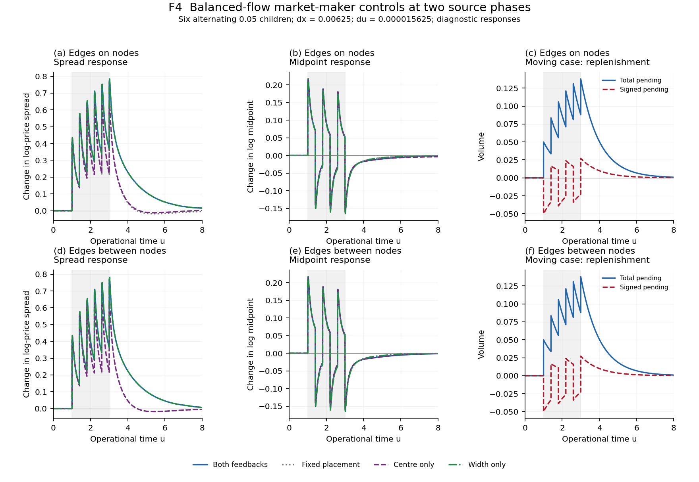

# Two Field Spread Reproducibility

**v0.5.5 — matched balanced-flow market-maker controls.** The density-derived figures, execution tape and correlations are implemented. Numerical/scientific acceptance remains pending: spread responses and long-path midpoint/spread correlations remain sensitive to resolution. The Markov DTRW core is unchanged from v0.4.1.

[Figures](#focused-numerical-outputs) · [Reproduce](#reproduce) · [Assessment](#v055-result) · [Algorithm](provenance/ALGORITHM.md) · [Supplement](provenance/supplement-v0.5.5.pdf) · [Sources](provenance/SOURCES.md)

Two densities evolve in operational time by nearest-neighbour diffusion, cancellation and symmetric reaction. Aggressive executions initiate causal opposite-side replenishment. Total pending stock sets placement width; signed pending stock sets its centre. Inward density thresholds define the observed bid, ask, log midpoint and spread. A buy consumes ask liquidity and initiates bid replenishment; a sell consumes bid liquidity and initiates ask replenishment.

## Focused numerical outputs


**F2. Density evolution.** Nine snapshots from six buys of volume 0.05 at u=1,1.4,1.8,2.2,2.6,3. Blue/red: bid/ask densities; grey: relaxed initial field. Dotted placement quotes differ from dashed threshold quotes. Threshold 0.1; dx=0.025, du=0.00025; domain [-12.0125,12.0125]. Pre/post pairs preserve execution impulses. Display window [-8,8].


**F3. Same-run prices and state.** Bid/ask/midpoint, actual fill-weighted execution log prices, observed spread and placement width, total/signed pending stock, cumulative execution/completion and placement centre. Placement uses old pending stock after delivery and before current execution. Completion is in volume units and does not generate another trade print.



**F4. Balanced controls.** Six alternating buy/sell children, each of volume 0.05. Compare both feedbacks, fixed placement, centre only and width only. Both rows use dx=0.00625, du=0.000015625; initial placement edges lie on nodes (top) or between nodes (bottom). Responses subtract each case's stationary initial value. Pending panels retain pre/post-event values. This is a finer grid than F2/F3. The two-grid comparisons, effects against fixed placement and nonlinear interaction are saved in `control-comparisons`. Earlier directional and next-update controls remain in the data.


**F5. Paths and ACFs.** First 512 retained events of seed 41001; then true signs, midpoint increments, execution-log-price increments, their absolute increments and spread. Coloured curves average eight paths of 8192 retained events after 2048 burn events, comparing order splitting/moving, independent signs/moving and the same splitting tapes/fixed placement. Bands are descriptive mean ± two between-path standard errors. Dashed sign reference: exact finite-cap stationary renewal benchmark. Coloured curves use dx=0.05, du=0.001. Black midpoint/spread curves compare two matched full tapes at dx=0.025/0.0125, common du=0.0000625; they have no ensemble band. These remain diagnostic, not accepted limiting laws.


**F6. Cross-correlations.** Same paths and uncertainty convention. Positive lag means the first observable leads the second. Signed sign/spread-change and midpoint/spread-change correlations can cancel under buy/sell symmetry; magnitude/spread correlations address a different question. Correlation does not establish causality.

[](figures/density-v0.5.5.mp4)

**V1. [24-second profile video](figures/density-v0.5.5.mp4).** F2/F3 trajectory, fixed axes and operational-time/phase labels. Stored states are held between frames; each execution has consecutive pre/post frames. No interpolation across impulses. Five PNG/PDF figure pairs and this video are the complete inventory.

## Reproduce

Python 3.12 is the controlled environment. Install FFmpeg with the libx264 encoder and put `ffmpeg` on PATH. NumPy and Matplotlib are pinned in `pyproject.toml`.

From the repository directory, Linux/macOS:

```bash
python -m venv .venv
.venv/bin/python -m pip install -e .
.venv/bin/python scripts/run_all.py
```

Windows PowerShell, from the repository directory with Python installed:

```powershell
$ErrorActionPreference = 'Stop'
python -m venv .venv
if ($LASTEXITCODE -ne 0) { throw 'Environment creation failed' }
$Python = Join-Path (Get-Location) '.venv\Scripts\python.exe'
& $Python -m pip install -e .
if ($LASTEXITCODE -ne 0) { throw 'Installation failed' }
ffmpeg -version
if ($LASTEXITCODE -ne 0) { throw 'Install FFmpeg with libx264 and add it to PATH' }
& $Python scripts/run_all.py
if ($LASTEXITCODE -ne 0) { throw 'Reproduction failed' }
```

The command runs 29 focused tests, 24 numerical assessment cases, 39 market-maker comparisons, 26 benchmark paths plus four common-step resolution paths, and the four main pilot/control trajectories, then produces all figures and the video. A repeat uses the same command. `python scripts/run_all.py --render-only` verifies the configuration/code/data hashes and redraws from saved states without solving. `python scripts/run_all.py --diagnose-only` verifies the saved inputs/data and exactly reproduces the bounded operator diagnosis and paper audit without evolving a path. `python scripts/run_all.py --refine-only` verifies saved inputs/data, repeats the six registered v0.5.4 finite refinement paths, and requires exact reproduction of the assessment arrays and comparison report. It preserves the inherited paths. `python scripts/run_all.py --controls-only` verifies saved inputs/data, independently repeats all 16 balanced-control refinements and their comparison report, and requires exact output identity. The 23 inherited controls are preserved. A changed dynamical input requires the complete route. The tested runtime is Python 3.12.14, NumPy 2.3.5 and Matplotlib 3.10.8 on Linux; Windows execution remains a later milestone.

## Configuration and retained data

`config/experiments-v0.5.5.json` is the sole active configuration. Parameters are dimensionless and illustrative: D=nu=1, kappa=0.5, Sigma0=12, chi_s=2, chi_m=0.5, completion time=1, outward placement width=0.5. Equal lit/latent amplitudes and lengths give constant total external supply outside placement edges. There is no empirical calibration.

| Directory | Active content |
|---|---|
| `config/` | One complete experiment configuration |
| `functions/` | Core, observations, finite driver, assessment, renderer |
| `scripts/` | One reproduction entry point |
| `tests/` | Three focused test files |
| `outputs/` | Fields, actual fills, paths, correlations, comparisons and hashes |
| `figures/` | F2–F6 PNG/PDF pairs; V1 MP4 and poster |
| `provenance/` | Algorithms, supplement, source identities and lineage audit |

The density archive retains incoming/pre/post fields, actual removals and source increments. Long paths retain all 10240 events, signs, distinct parents, lengths/ages, actual node fills and offsets; named columns identify the state matrices. `example-trades` contains the complete first moving-path tape with arithmetic and geometric execution prices. Correlation CSVs retain pair counts. Resolution paths retain source-membership changes and execution/field decomposition. Old generated versions remain in Git history and immutable checkpoints, outside the active file set.

The sign input is a stationary single-active-parent renewal benchmark with independent centred parent signs and capped integer lengths L=min(floor(2(1-U)^(-1/1.5)),512). The first parent is length-biased with uniform age. Child volume is 0.002 every 0.01 operational units; seeds 41001–41008. The exact sign reference is E[(L-k)+]/E[L]. It is not the full concurrent-parent LMF population, and no asymptotic exponent has been fitted or accepted.

## v0.5.5 result

Sixteen balanced controls cross dx=0.0125/0.00625 at common du=0.000015625, two source phases and four feedback settings. Each executes six alternating children of 0.05 through u=8. The original DTRW core, event chronology, threshold, completion law and physical child volumes are unchanged.

| Initial edge phase | Feedback | Absolute spread difference | Spread-response difference |
|---|---|---:|---:|
| On nodes | Both | 0.00889481 | 0.01075360 |
| On nodes | Fixed | 0.00966319 | 0.00339765 |
| On nodes | Centre only | 0.00626837 | 0.00796569 |
| On nodes | Width only | 0.00868693 | 0.01075331 |
| Between nodes | Both | 0.00597096 | 0.00598659 |
| Between nodes | Fixed | 0.00349453 | 0.00347890 |
| Between nodes | Centre only | 0.00471252 | 0.00472814 |
| Between nodes | Width only | 0.00617445 | 0.00619008 |

All eight spatial comparisons pass the unchanged 0.01 absolute-spread tolerance. That pass does not establish response convergence: on-node both-feedback and width-only spread responses differ by about 0.01075. Maxima are over common 0.02 output times, using post-event states at child times. They do not bound every update or certify balanced-control time-step convergence. Both phases are retained, including the less favourable on-node results.

Actual gross executed volume is 0.3 in every new run, with unfilled volume below 1e-12. Maximum field-budget and completion-ledger errors are 3.72e-15 and 4.11e-15. All initializations meet the 1e-8 rate-residual requirement. Accounting and admissibility are checked every update. Matched pending stocks and the width/centre placement laws pass the additional comparison checks.

The report also retains each feedback effect against fixed placement and the full-minus-width-only-minus-centre-only-plus-fixed interaction. These are controlled differences, not additive causal shares. The long-path ACF/CCF ensemble is unchanged and remains diagnostic.

**Next numerical step:** register a bounded follow-up to resolve the sensitive control responses: matched time-step checks and targeted spatial refinement, retaining both source phases and unchanged source support. Establish response accuracy before aggregate-activity or long-ensemble expansion. No tolerance is relaxed and no source smoothing or additional agent is proposed.

## Remaining numerical and modelling limits

The inherited directional refinement passes the 0.01 absolute-spread comparison at both phases, but its on-node response differs by 0.01073. Half-cell padding preserves reflection while moving each reservoir by dx/2; separate domain checks are retained. Hard nodal supports and node-centre execution are unchanged, with no smoothing.

Two full-tape spatial refinements change midpoint and spread ACFs by up to 0.10340 and 0.12893. Fine-grid lag-one midpoint ACF is 0.636–0.651; whitening is not established. Trade-return statistics are less sensitive in those pairs, without a general convergence result. Frozen-operator diagnostics and a continuous execution-price reference separate some discretization effects; neither replaces the evolving solver. See the retained diagnosis and paper-audit outputs.

The fields aggregate order activity with an order-level DTRW interpretation. Static sources do not specify chartist/fundamentalist strategies, and the present mechanism tests require no additional agent population. Total and signed pending stocks differ even under balanced gross activity. Opposite-side replenishment is a completion-equivalent source closure, not an explicit second executed leg or a dealer profit calculation. Exact accounting does not establish financial equilibrium. Positive Sigma0 is imposed, so this pilot does not establish spread emergence from zero standoff. One programme size supplies no square-root-impact exponent. Systematic spread-dependent meta-order response and impact remains future v1.1.0.

## DTRW compatibility and paper provenance

The common Markov transport operator was checked against exact v2.0.0 source. The paper uses Euler cancellation while the prototype uses an exponential survivor; their finite-step difference and differing execution chronology are documented in the algorithm mapping. These are component checks, not whole-model equivalence. Execution prices and overlapping-pair Pearson ACFs follow the prior executable conventions.

Future Sibuya transport requires a history and a derived treatment of reaction, births and consumed volume. Keep it separate from sign memory, finite-mean completion and calendar subordination. No fractional transport or calendar clock is implemented. The supplement preserves the kernel, survival, scaling and completed-state observation conventions.

The prototype is [correlation-emergence v2.2.0](https://github.com/timgebbie/correlation-emergence-reproducibility/releases/tag/v2.2.0), with no runtime dependency. [Source provenance](provenance/SOURCES.md) connects the formulation to Diana–Gebbie CAM and Angstmann–Gebbie correlation emergence, and records exact manuscript/prototype identities. The current letter is SpreadLetter v1.2.0 by Christopher Angstmann, Derick Diana and Tim Gebbie; the supplied long paper remains v1.1.9. Neither manuscript is edited. Reaction price and quoted midpoint remain distinct; the distributed outward profile is not replaced by its narrow-placement limit. Private manuscripts and recovery administration remain outside the source tree.
